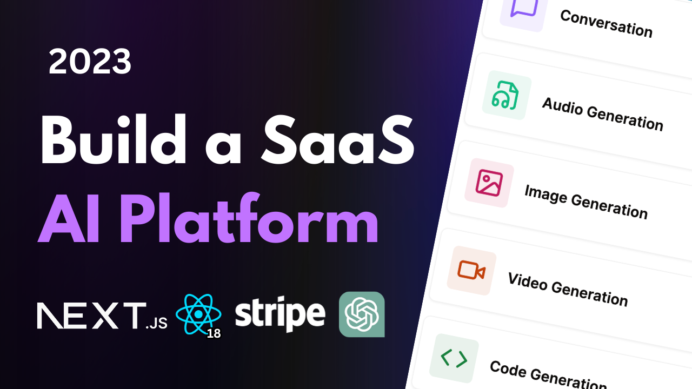

<p align="center">
  
  
  
  
</p>

This is a repository for Build a SaaS AI Platform with Next.js 13, React, Tailwind, Prisma, Stripe | Full Tutorial 2023.

[VIDEO TUTORIAL](https://www.youtube.com/watch?v=ffJ38dBzrlY)

## Features:

- [x] Folder structure in Next 13 App Router
- [x] Tailwind / Full responsiveness
- [x] Clerk Authentication (Email and Social Logins)
- [x] Client form validation and handling using react-hook-form
- [x] OpenAI Tools (Image and conversation)
- [ ] Stripe monthly subscription
- [x] Free tier with API limiting

### Cloning the repository

```shell
git clone https://github.com/alantomaiz/ai-saas
```

### Install packages

```shell
npm install
```

### Setup .env file

```shell
# Next
NEXT_PUBLIC_URL=""

# Clerk Auth
CLERK_SECRET_KEY=""
NEXT_PUBLIC_CLERK_PUBLISHABLE_KEY=""

NEXT_PUBLIC_CLERK_SIGN_IN_URL="/sign-in"
NEXT_PUBLIC_CLERK_SIGN_UP_URL="/sign-up"
NEXT_PUBLIC_CLERK_AFTER_SIGN_IN_URL="/dashboard"
NEXT_PUBLIC_CLERK_AFTER_SIGN_UP_URL="/dashboard"

# OpenAI
OPENAI_CLIENT_ID=""
OPENAI_API_KEY=""

# Prisma
DATABASE_URL=""

# Stripe
STRIPE_WEBHOOK_KEY=""
STRIPE_API_KEY=""
NEXT_PUBLIC_STRIPE_PUBLIC_KEY=""

# Crisp
NEXT_PUBLIC_CRISP_ID=""
```

### Setup Prisma

Add MySQL Database (I used PlanetScale)

```shell
npx prisma db push

```

### Start the app

```shell
npm run dev
```

## Available commands

Running commands with npm `npm run [command]`

| command | description                              |
| :------ | :--------------------------------------- |
| `dev`   | Starts a development instance of the app |

---


